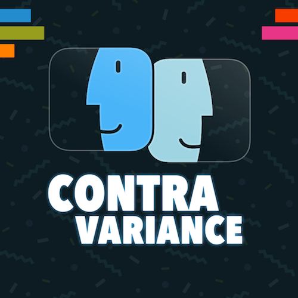

  

I am really excited to tell you that I've started a podcast, together with [Benedikt Terhechte](https://twitter.com/terhechte)!

Benedikt and I have been thinking about this for quite a while, and now it's here! it is called Contravariance. In the podcast we discuss topics like Swift, Apple and programming in general.

The first episode, `applicationDidFinishLaunching:`, is out now, and you can listen to it on [iTunes](https://itunes.apple.com/us/podcast/contravariance-a-swift-podcast/id1423771323#), [Overcast](https://overcast.fm/+OMAGgV1TI), [Pocket Casts](https://pca.st/QjR1) or in your other favorite podcast app of choice.

You can follow Contravariance on Twitter [here](https://twitter.com/_contravariance).
You can check out the website [here](https://contravariance.rocks) (which is also [open sourced](https://github.com/contravariance/website)).

Let us know what you think!
