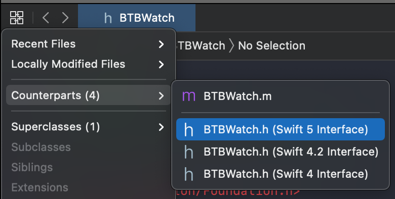

# Table of Contents

In this blog post...

- [Introduction](#introduction)
- [Generated Interfaces](#generated-interfaces)
- [Intermission (Why Swift?)](#intermission-why-swift)
- [Nullability](#nullability)
- [Methods and Properties](#methods-and-properties)
- [Swift Renaming](#swift-renaming)
- [Enums and Option Sets](#enums-and-option-sets)
- [Generics](#generics)

# Introduction

I've been meaning to blog about Swift and Objective-C interoperability for quite
some time. It's a topic that may no longer be that "hot" anymore — when I told a
friend I wanted to write on the topic, I was told "but no one is writing
Objective-C code, and thus, interop code anymore!" While it may be a minority,
I know there are a few companies that still write Objective-C, as well as
projects that still have so called "legacy" Objective-C code that they may not
want to rewrite... but _do_ want to use from Swift.

While I'm not sure if this series of blog posts will end up being a "source"
to reference when it comes to Objective-C interop... but I hope it can teach
you some things regardless.

# Generated Interfaces

Before going through certain aspects of annotating your Objective-C headers
(which is basically what allows you to interop between your Objective-C and
Swift code), I want to start where, well, we should start: _generated
interfaces_. Xcode allows us to, for a given Objective-C header, generate its
accompanying Swift interface. Which at worst may be empty, and at best (already)
exposes your complete interface to Swift.

Near the top left of the main Xcode interface is a button called "Related Items".
It's the button of connected squares right beneath your project name in the top
bar.

Clicking on it reveals a bunch of options — I'd encourage you to check them all
out! But for now, let's go to **Related Items > Counterparts > MyHeader.h >
(Swift 5 Interface)**. As you can see, there are, at the time of writing,
options to look at the Swift 4, 4.2, and 5 interfaces.



While troubleshooting your generated interface is beyond the scope of this post,
if no interface is being generated at all, check if you're importing Foudation
(`#import <Foundation/Foundation.h>`). I've found this to often be the culprit
of a) preventing the interface from being generated or b) all types to be `Any`
in Swift.

### Intermission (Why Swift?)

While you're probably here because you're interested in reading about making
your Objective-C code accessible from Swift, you may just wonder: why? Why
Swift? Or perhaps, for whatever reason, you can't write production code in Swift
and "simply" want to prepare your Objective-C code for a future where you can.

For the first question: in Swift, the compiler can do so much more to help you
write valid, safe code. Switches can be exhaustive, causing compiler errors when
you add new cases to an enum. On the topic of switches... they are so much more
powerful allowing your to write more expressive, safe code. No longer can you
only switch on integers. You can switch and pattern match using pretty much
anything, like strings.

For the second "question": auditing your code base to interface well with Swift
has two clear benefits. First of all, it allows you to start writing Swift in
non-production code, like tests — which is a great way to start writing Swift
code as well as verifying if your Objective-C code properly interfaces with
Swift.

Secondly, it can help reason about your code in Objective-C, and the compiler
can emit some warnings when you don't keep to the "contract". One of those is
lightweight generics, where the compiler will warn you when you put, for
example, an `NSString` in an array that you told the compiler will only contain
`NSNumber` instances. There's also the concept of nullability — should this
thing ever be able to be `nil`? In Swift, the compiler will guarantee these
things, and error if you don't comply to the rules. In Objective-C the compiler
will be tame, and only emit warnings. There (still) be dragons.

# Nullability

Nullability is the concept of defining if a type can be `nil` or not, guaranteed
by the compiler in Swift. There's a few keywords in play:

- `nonnull` — guarantees a type can never be `nil`.
- `nullable` — indicates a type can be `nil` — or _optional_ in the Swift world.
- `null_unspecified` — indicates a type can technically be `nil`, but really isn't
expected to be in practice. An example of this would be an Interface Builder
outlet. It will be `nil` at some point, but will be nonnull by the time the
view has loaded.
- `null_resettable` — for completion of the list, but it is generally
discouraged to use this one. It's practically the same as `null_unspecified`,
but the idea is that setting the type to `nil` will "reset" it to its default
value — whatever that may be. This is in no way guaranteed by the compiler,
however, which is not really what we want.

And then there are two more, and they are good friends:

- `NS_ASSUME_NONNULL_BEGIN`
- `NS_ASSUME_NONNULL_END`

These will be in any new Objective-C header created by Xcode, and do what they
say on the tin: they expose everything as `nonnull` by default — also the
default in Swift. It would be quite cumbersome to annotate _everything_ as
`nonnull`, so these make the whole thing a lot easier!

Let's take a look at these in action with the following Objective-C header file.

```objc
#import <Foundation/Foundation.h>

@interface BTBWatch : NSObject

- (NSInteger)currentHour;
- (NSInteger)currentMinute;
- (NSInteger)currentSecond;
- (NSDate *)currentDate;

- (BOOL)setTimeWithHours:(NSInteger)hours
                 minutes:(NSInteger)minutes
                 seconds:(NSInteger)seconds
                   error:(NSError **)error;
- (void)printCurrentTime;

@property (nonatomic) NSString *strapType;
@property (nonatomic, readonly) NSArray *functions;

@end
```

If we look at its generated interface, this is what we're starting off with:

```swift
open class BTBWatch : NSObject {
    open func currentHour() -> Int
    open func currentMinute() -> Int
    open func currentSecond() -> Int
    open func currentDate() -> Date!

    open func setTimeWithHours(_ hours: Int, minutes: Int, seconds: Int) throws
    open func printCurrentTime()

    open var strapType: String!
    open var functions: [Any]! { get }
}
```

Notice `Int` is not implicitly unwrapped — as these are backed by value types
in Objective-C (where they can not be `nil`), neither will they be in Swift.

Let's start with the "buddies" `NS_ASSUME_NONNULL_BEGIN` and `NS_ASSUME_NONNULL_END`;
we're seeing exclamation points in our generated interface... as we discussed
previously, we generally want to avoid these. And as you can imagine,
`currentDate`, for example, should always return a non-`nil` date.

(Oh, and while we're here... going to **Related Items > Counterparts >
MyHeader.h > (Swift 5 Interface)** again may not reflect any updates made to the
header. Not sure why that is the case. You can most often switch back-and-forth
to Swift 4.2 and 5, and it will regenerate.)

```objc
NS_ASSUME_NONNULL_BEGIN

@interface BTBWatch : NSObject

/// Interface here

@end

NS_ASSUME_NONNULL_END
```

```swift
open class BTBWatch : NSObject {
    open func currentHour() -> Int
    open func currentMinute() -> Int
    open func currentSecond() -> Int
    open func currentDate() -> Date

    open func setTimeWithHours(_ hours: Int, minutes: Int, seconds: Int) throws
    open func printCurrentTime()

    open var strapType: String
    open var functions: [Any] { get }
}
```

### Nullable

While you'd probably, at the very least most often, have a watch _with_ a strap
(or bracelet) on, it may not always be the case. So let's make it optional.

```objc
@property (nonatomic, nullable) NSString *strapType;
```

```swift
open var strapType: String?
```

Now, the compiler allows us to set it to `nil` for those cases we don't have
the watch attached to a strap or bracelet.

And, we only have to annotate the one property, instead of annotating all the
remaining ones with `nonnull` courtesy of `NS_ASSUME_NONNULL`.

## Methods and Properties

Whereas in Objective-C, at the call site, there's not that much of a difference
between methods and properties — you can call both a property `isRunning` and
a method `isRunning` as `[myWatch isRunning]`, but in Swift this would be
different: `myWatch.isRunning` versus `myWatch.isRunning()`. Generally, you
want to make base this on [performance](https://www.swiftbysundell.com/tips/computed-properties-vs-methods/);
properties when something can be executed in `O(1)` time; otherwise, use a
function.

Going back to our Watch example, that means we'd probably want to convert our
`current*` functions to properties.

So instead of

```objc
- (NSInteger)currentHour;
- (NSInteger)currentMinute;
- (NSInteger)currentSecond;
- (NSDate *)currentDate;
```

which would generate, as we've seen earlier:

```swift
open func currentHour() -> Int
open func currentMinute() -> Int
open func currentSecond() -> Int
open func currentDate() -> Date
```

we'd want

```objc
@property (nonatomic, readonly) NSInteger currentHour;
@property (nonatomic, readonly) NSInteger currentMinute;
@property (nonatomic, readonly) NSInteger currentSecond;
@property (nonatomic, readonly) NSDate *currentDate;
```

which generates the following:

```swift
open var currentHour: Int { get }
open var currentMinute: Int { get }
open var currentSecond: Int { get }
open var currentDate: Date { get }
```

# Swift Renaming

In Swift, we generally use a different naming strategy than in Objective-C.
A big reason for this is the difference in the way we write functions. Where in
Objective-C, the first argument is always part of the function name, in Swift,
it will be like any other argument — and thus, looking at our example again:

```swift
open func setTimeWithHours(_ hours: Int, minutes: Int, seconds: Int)
```

Is something we'd probably want to rename in Swift. While sometimes the
generated interface is already smart enough to infer these "Swiftier" names,
in this case, it didn't. We can explicitly name it using `NS_SWIFT_NAME`, like
so:

```objc
- (void)setTimeWithHours:(NSInteger)hours
                 minutes:(NSInteger)minutes
                 seconds:(NSInteger)seconds
                   error:(NSError **)error NS_SWIFT_NAME(setTime(hours:minutes:seconds:));
```

which now generates the following, renamed function:

```swift
open func setTime(hours: Int, minutes: Int, seconds: Int) throws
```

Notice we omit the `error` parameter, as this is natively bridged to use
`throws` in Swift.

### Namespaces

As in Swift we have namespaces, we would probably also want to consider dropping
our class suffix:

```objc
NS_SWIFT_NAME(Watch)
@interface BTBWatch : NSObject
```

```swift
open class Watch : NSObject {
    // ...
}
```

### Nesting Types

Let's add something to our class: an enum that describes the kind of movement
in our watch:

```objc
typedef NS_ENUM(NSInteger, BTBMovementType) {
    BTBMovementTypeQuartz,
    BTBMovementTypeManual,
    BTBMovementTypeAutomatic
} NS_SWIFT_NAME(MovementType);
```

and let's take a look at what this exposes in Swift:

```swift
public enum MovementType : Int {
    case quartz = 0
    case manual = 1
    case automatic = 2
}
```

In Swift, we can _nest_ types. Which would probably make sense to use here;
we would nest it under our `Watch`; its associated or "parent" object:

```objc
typedef NS_ENUM(NSInteger, BTBMovementType) {
    BTBMovementTypeQuartz,
    BTBMovementTypeManual,
    BTBMovementTypeAutomatic
} NS_SWIFT_NAME(Watch.MovementType);
```

which generates the following:

```swift
extension Watch {
    public enum MovementType : Int {
        case quartz = 0
        case manual = 1
        case automatic = 2
    }
}
```

One thing to note here is that we use `NS_ENUM`; `NS_CLOSED_ENUM` also exists.
You would use this if you're absolutely sure this enum will not change going
forward; imagine, for example, a traffic light only ever having a red, yellow,
and green light.

If you want to read more about why you'd want to make sure to get this right,
and what it means in Swift, I suggest [this great blog post](https://swiftbysundell.com/articles/using-an-unknown-default-case-within-a-switch-statement/)
by [John Sundell](https://twitter.com/johnsundell).

# Enums and Option Sets

Our watch is made by someone, some brand. Let's explore how we could write this
in Objective-C, and how we can best expose that to Swift:

```objc
NS_ASSUME_NONNULL_BEGIN

const NSString *patekPhilippe;
const NSString *aLangeSoehne;
const NSString *omega;
const NSString *meisterSinger;

NS_SWIFT_NAME(Watch)
@interface BTBWatch : NSObject

// ...
```

As-is, Swift generates the following:

```swift
public let patekPhilippe: String
public let aLangeSoehne: String
public let omega: String
public let meisterSinger: String
```

But in Swift, this can be expressed in a more elegant, typed way:

```objc
NS_ASSUME_NONNULL_BEGIN

NS_SWIFT_NAME(Watch.Brand) typedef NSString * WatchBrand NS_TYPED_EXTENSIBLE_ENUM;
const WatchBrand patekPhilippe;
const WatchBrand aLangeSoehne;
const WatchBrand omega;
const WatchBrand meisterSinger;

NS_SWIFT_NAME(Watch)
@interface BTBWatch : NSObject

// ...
```

Which generates the following in Swift:

```swift
extension Watch {
    public struct Brand : Hashable, Equatable, RawRepresentable {
        public init(_ rawValue: String)
        public init(rawValue: String)
    }
}

extension Watch.Brand {
    public static let patekPhilippe: Watch.Brand
    public static let aLangeSoehne: Watch.Brand
    public static let omega: Watch.Brand
    public static let meisterSinger: Watch.Brand
}
```

We could then even extend this in Swift:

```swift
extension Watch.Brand {
    public static let mondaine: Watch.Brand
}
```

And, as you may have noticed, we can use this new "type" `Watch.Brand`. Whilst
`NSString` under the hood, only `Watch.Brand` "types" can be passed.

### Option Sets

Imagine we'd want to describe what kind of _complications_ our watch has.
For this, we can use an option set.

In Objective-C:

```objc
typedef NS_OPTIONS(NSInteger, BTBComplication) {
    BTBComplicationDateWindow            = 1 << 0,
    BTBComplicationPowerReserveIndicator = 1 << 1,
    BTBComplicationChronograph           = 1 << 2
} NS_SWIFT_NAME(Watch.Complication);
```

Generates the following, fully typed and very powerful,

```swift
extension Watch {
    public struct Complication : OptionSet {
        public init(rawValue: Int)

        public static var dateWindow: Watch.Complication { get }
        public static var powerReserveIndicator: Watch.Complication { get }
        public static var chronograph: Watch.Complication { get }
    }
}
```

Note, particularly, that this conforms to the protocol `OptionSet`, transiently
conforming to `SetAlgebra`, which gives us [these functions](https://developer.apple.com/documentation/swift/setalgebra)
for free, making for a much more expressive type than is possible in
Objective-C.

# Generics

In terms of our watch's functions, let's say we're storing them as `NSString`
instances. We'd not want a "random" `NSInteger` sneaking in there, now would we?

Let's annotate it, going from

```objc
@property (nonatomic, readonly) NSArray *functions;
```

which generates

```swift
open var functions: [Any] { get }
```

we change it to

```swift
@property (nonatomic, readonly) NSArray<NSString *> *functions;
```

which generates

```swift
open var functions: [String] { get }
```

## ... So Now What?

Well, this is a great start in making your Objective-C code interoperable with
Swift. To go deeper into this topic, I very much recommend the WWDC session [Refine Objective-C frameworks for Swift](https://developer.apple.com/videos/play/wwdc2020/10680/).
